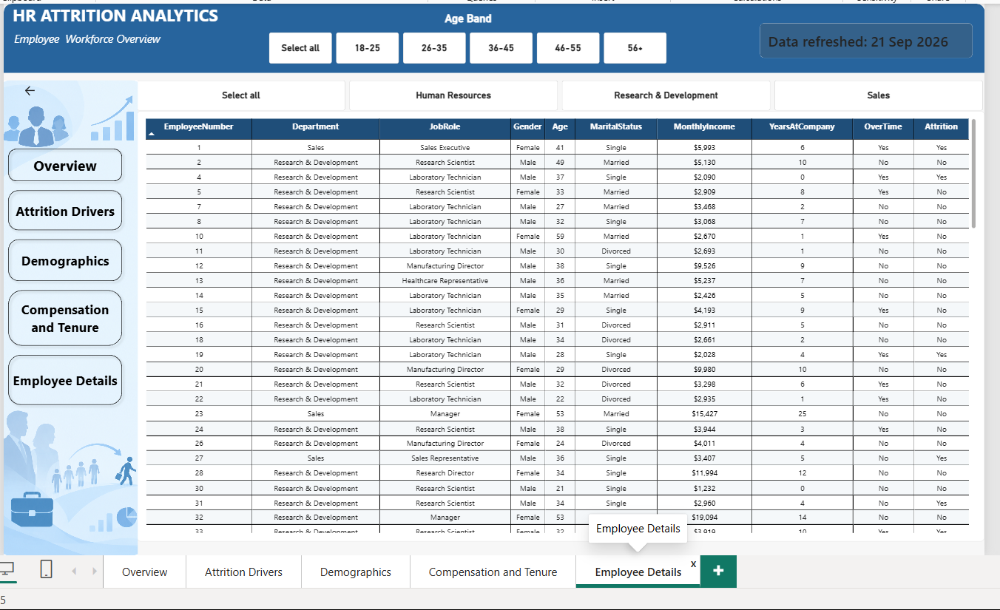
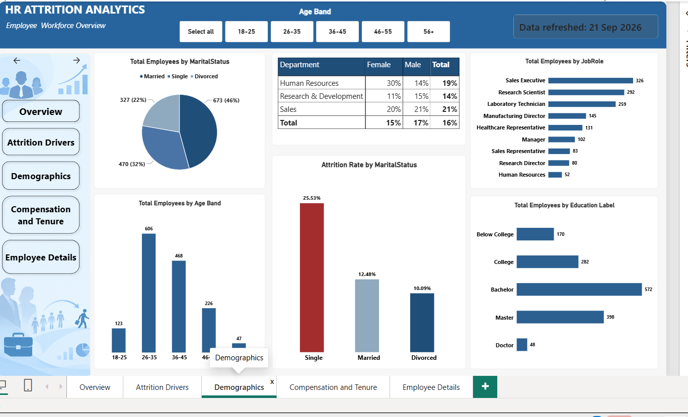

# HR Analytics Dashboard

An end-to-end HR analytics project built with **Power BI, Python, Pandas, and Jupyter Notebook** to analyze employee attrition, workforce demographics, compensation, tenure, performance, training, and related HR patterns.

## Project Structure

```text
HR-Analytics-Dashboard/
│
├── README.md
│
├── powerbi/
│   └── HR Analytics Dashboard.pbix
│
├── data/
│   ├── raw/
│   │   └── WA_Fn-UseC_-HR-Employee-Attrition.xlsx
│   └── processed/
│       └── HR_Analytics_Cleaned.csv
│
├── python/
│   └── HR_Analytics(1).ipynb
│
└── assets/
    └── dashboard/
        ├── Overview.jpg
        ├── Attrition Drivers.jpg
        ├── Demographics.jpg
        ├── Compensation and Tenure.jpg
        └── Employee Details.jpg
```

> **File status:** The dashboard screenshots and README are currently in this repository. The PBIX file and original Excel workbook are not currently available in the connected GitHub repository, so they still need to be uploaded. The cleaned CSV and Python notebook are available in the working project files and can be added to the matching folders.

## Business Problem

Employee attrition can increase recruitment costs, create skill gaps, reduce team stability, and affect productivity. This project examines where attrition occurs and which workforce characteristics are associated with employee turnover.

### Questions addressed

- Which departments and job roles show different attrition patterns?
- How does overtime relate to attrition?
- How do job level and monthly income vary with attrition?
- How do business travel, age, tenure, and distance from home relate to attrition?
- How do demographics, performance, training, compensation, and stock options vary across the workforce?

## Project Workflow

**Raw Data → Data Cleaning → Exploratory Data Analysis → HR Metrics → Power BI Data Model → Dashboard → Business Insights**

## Python Analysis

The Python/Jupyter analysis covers:

- Dataset structure and data quality
- Employee demographics
- Department and job-role distribution
- Overall attrition rate
- Attrition by department, job role, overtime, and business travel
- Age, distance from home, tenure, and compensation analysis
- Job level and stock option analysis
- Correlation analysis
- IQR-based outlier analysis
- Department-level attrition analysis

## Power BI Dashboard

The dashboard contains five pages:

1. **Overview** — workforce KPIs and overall attrition patterns
2. **Attrition Drivers** — overtime, job satisfaction, stock options, income, and related factors
3. **Demographics** — age, gender, marital status, education, department, and job roles
4. **Compensation and Tenure** — income, tenure, job level, promotion, performance, and training
5. **Employee Details** — employee-level information for detailed investigation

## Dashboard Preview

Click an image to open the full-size screenshot.

### Overview
[](assets/dashboard/Overview.jpg)

### Attrition Drivers
[](assets/dashboard/Attrition%20Drivers.jpg)

### Demographics
[](assets/dashboard/Demographics.jpg)

### Compensation and Tenure
[](assets/dashboard/Compensation%20and%20Tenure.jpg)

### Employee Details
[](assets/dashboard/Employee%20Details.jpg)

## Tools & Technologies

- **Power BI** — dashboard development, Power Query, DAX, and data modeling
- **Python** — exploratory data analysis
- **Pandas** — data cleaning and analysis
- **Jupyter Notebook** — analysis workflow
- **Excel** — source dataset / data preparation
- **CSV** — cleaned analytical dataset

## Business Perspective

The dashboard is intended to help HR teams investigate attrition patterns, workforce composition, compensation, employee development, and areas that may require further investigation.

> The analysis identifies patterns and relationships in the dataset. It does not establish that a particular factor directly causes employee attrition.

## Dataset Limitations

The dataset does not contain the information required to calculate some common HR metrics such as time-to-hire, absenteeism rate, manager span of control, or compa-ratio. These metrics are therefore not presented as calculated measures.

## Project Outcome

This project demonstrates practical skills in **data cleaning, exploratory data analysis, HR analytics, Power BI, DAX, data visualization, statistical outlier analysis, and translating analytical results into business-focused insights**.

## Author

**Syed Mohammed Ghouse**

GitHub: https://github.com/s4184271-sys
